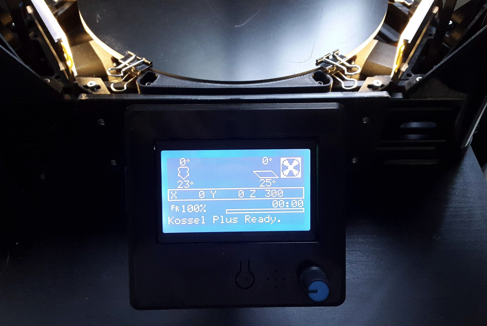

# Knutwurst's Kossel Plus Firmware (based on Marlin 2.0.x)

(BITTE GENAU DURCHLESEN! / PLEASE READ CAREFULLY!)

### Wenn dir gefällt, was ich mache, kannst du mir hier einen Kaffee spendieren*: 
*Es muss jetzt keine großzügige Spende sein. Ein paar Cent reichen um mir zu zeigen, wer überhaupt Interesse daran hat und wem die Weiterentwicklung wichtig ist. So bleibt die Motivation da und ich weiß einfach, dass ich nicht für die Tonne programmiere ;)

### Wenn du Fragen hast, schaue gern in der offiziellen [Facebook-Gruppe](https://www.facebook.com/groups/3094090037303577/) vorbei.

# Readme - German (english below)

Diese Firmwarekonfiguration aktiviert viele neue erweitere Funktionen der Marlin Firmware:

 * Automatische Kalibrierung
 * S-Kurven Beschleunigung
 * Babystepping während des Druckvorgangs (Doppelklick mit dem Kontrollknopf)
 * Unified Bed Leveling (UBL)
 * Manuelles Editieren der Messpunkte über das Display
 * Volle LCD 12864 Unterstützung
 * Fortschrittsbalken für 2004 und 12864 Displays
 * Pause & Filamentwechselfunktion

...Und Spiele! (unten klicken)

**Wichtig:**
Bevor du irgendwas machst, nachdem du die Firmware geupdated hast, gehe zu `Configuration > Advanced Settings > Initialize EEPROM` um alte Einstellungen zu löschen!

Bitte teste mit einem Blatt Papier die Z-Höhe. Die Düse sollte bei Z=0.00 fast auf dem Druckbett aufliegen. Falls nicht, stelle die Z-Sensor Höhe noch einmal ganz genau ein und ändere den Wert unter `Configuration > Advanced Settings > Probe Z Offset`.

**Anleitung: Korrekten Z-Probe Offset bestimmen**

1. Lege ein Blatt Papier auf das Druckbett.
2. Fahre die Düse auf das Bett, so dass das Blatt sich gerade so eben noch bewegt, aber schwergängig ist. Falls du selbst bei 0.00 noch Luft zwischen Düse und dem Blatt Papier hast, gehe zurück und deaktiviere die "Soft Endstops". Die Einstellung ist aber gefährlich, da du jetzt auch weiter als eigentlich möglich runter fahren kannst und damit die Düse beschädigen kannst. Also sei vorsichtig!
3. Notiere dir den Wert im Display. (z.B. +0.20)
3. Fahre die Z-Achse etwas hoch und klemm die Probe drunter.
4. Fahre langsam wieder runter (in 0,01mm Schritten) und zwar genau bis du das Klicken hörst. Nicht weiter!
5. Notiere dir den neuen Wert im Display. (z.B. +16.40)
5. Ziehe den Wert von Punkt 5 von dem Wert von Punkt 3 ab. -> 0.20 - 16.40 = -16,20 
6. Trage den errechneten Wert als Z-Probe Offset ein.
Wenn der Offset NICHT dem entspricht, was aktuell eingetragen ist (Standard ist -16,20), dann MUSST du die Autokalibrierung danach noch mal ausführen.

Nachdem alles überprüft ist, gehst du zu `Configuration > Delta Calibration > Auto Calibration` um die automatische Kalibrierung auszuführen. Die Einstellungen werden automatisch gespeichert. 

Du solltest danach `Motion > Unified Bed Leveling > Step by Step bed leveling` ausführen und mit `Store Settings` abspeichern.

**WARNUNG! Ändere niemals die Delta-Höhe in den Einstellungen!**

Auf Youtube kursieren einige Videos, in denen gezeigt wird, wie man mit Marlin 1.1.9 den Kossel levelt. Dies ist aber völlig veraltet und trifft nicht mehr auf diese Firmware zu! Im Grunde war es nur der Versuch, das nicht funktionierende Leveling und den falschen Z-Senstor Abstand zu kompensieren - aber es war niemals richtig. Also tue dir selbst einen Gefallen und spiele nicht an den errechneten Werten in der Delta-Konfiguration herum. Alles was du brauchst ist ein perfekter Z-Offset (zusätzliche Z-Höhe des Sensors), der dann erreicht ist, wenn du das leise Klicken hörst. UBL erledigt den Rest und du musst nie wieder mit Papier leveln oder Werte selbst errechnen.

# Wähle deine Konfiguration

**Bitte wähle die korrekten Einstellungen in dere Configuration.h Datei**

Der Kossel wird in 3 Versionen geliefert:

 * Pulley
 * Linear
 * Linear Plus

Pulley und Linear nutzen die selbe Konfiguration, aber der Linear Plus ist größer und benutzt andere Einstellungen.

Im Normalfall kommen die Anycubic Delta Kossel Drucker mit zwei verschiedenen Z-Sensor Versionen:

  * Version 1: Z Probe Offset von -19.0mm

    

  * Version 2: Z Probe Offset von -16.2mm

    

Wenn du in der Konfiguration `ANYCUBIC_PROBE_VERSION 0` ausgewählt hast: Es ist extrem wichtig, dass du die korrekte Prozedur zum Leveln durchführst, nachdem du die Firmware geflashed hast. Andernfalls kann es passieren, dass du deinen Drucker beschädigst, indem du die Düse in das Heizbett rammst.

* `Configuration > Advanced Settings > Initialize EEPROM`
* `Motion > Move Axis > Soft Endstops` : `Off`
* `Auto Home` Und dann langsam(!) runterfahren, bis die Düse ganz leicht das Bett berührt. (Benutze ein stück Papier. Wenn man einen Widerstand beim Verschieben spürt, ist es richtig) und notiere dir diese Zahl auf dem Display.
* Ziehe diese Nummer von der Delta-Höhe ab, bzw addiere sie zu dem Wert unter `Configuration > Delta Calibration > Delta Settings > Height`.
* Speichere und mache den Papier-Test noch mal. Bei Z=0.000 sollte nun die Düse genau das Papier berühren.
* `Configuration > Store Settings`
* `Motion > Unified Bed Leveling (UBL) > Manual Mesh Bed Leveling`

# Download

Du kannst die fertigen Binärdateien hier herunterladen: https://github.com/knutwurst/Marlin-2-0-x-Anycubic-Kossel-Linear-Plus/releases. Natürlich kannst du die Firmware mit PlatformIO oder der Arduino IDE auch selbst kompilieren.

Um es übersichtlich zu gestalten, beinhalten die Dateinamen die einzelnen Features.

`_PLUS` steht für den Kossel Linear Plus mit 240mm  Ultrabase.

`_12864` steht für das Vollgrafikdisplay mit 128x64 Pixeln.

`_TMC` steht für Trinamic TMC Motortreiber. Hierbei wird auch die Drehrichtung der Motoren invertiert.

`_BLTOUCH` steht für die BL-Touch Version mit Autoleveling-Sensor.

Für (fast) jede Kombination gibt es eine passende Firmware im Download-Bereich. ;)

---

### If you like what I do you can buy me a coffee: 
*It doesn't have to be a generous donation. A few cents are enough to show me who is interested in further development. So the motivation stays and I just know that I am not programming for the bin ;)

# Readme - English

These configurations activate many of the new advanced features of the Marlin firmware:

 * Auto Calibration
 * S-Curve Acceleration
 * Babystepping while printing (double click on control knob)
 * Unified Bed Leveling (UBL)
 * Manual Mesh Edit via LCD
 * Full LCD 12864 Full Graphic Smart Controller Support
 * Progress Bar support for 2004 and 12864 LCD
 * Pause & Filament Change

...and Games! (click below)

**Important**: Before doing anything else after updating the firmware, go to `Configuration > Advanced Settings > Initialize EEPROM` to get rid of old configurations.

Please test the Z-height with a sheet of paper. At Z = 0.00 the nozzle should almost rest on the print bed. If not, set the Z-probe height again and change the value under `Configuration> Advanced Settings> Probe Z Offset`.

**Tutorial: Get the correct z probe offset**

1. Pace a sheet of paper on the heated bed.
2. Slide the nozzle onto the bed so that the sheet is just about to move. If you still have a gap between the nozzle and the sheet of paper even at 0.00, go back and deactivate the "Soft Endstops". The setting is dangerous however, because you can now go further down than actually possible and thus damage the nozzle and the bed. So be careful!
3. Write down the value on the display. (e.g. +0.20)
3. Run the Z-axis up a little and clamp the probe underneath.
4. Slowly drive back down (in 0.01mm steps) until you hear the click. Do not go further!
5. Write down the value on the display. (e.g. +16.40)
5. Subtract the value of point 5 from the value of point 3. -> 0.20 - 16.40 = -16.20
6. Enter the calculated value as a Z probe offset.
If the offset does NOT correspond to what the current default value is (-16.20), you MUST perform the auto calibration again afterwards.

After everything is checked, go to `Configuration> Delta Calibration> Auto Calibration` to perform the automatic calibration. The settings are saved automatically.

You should then execute `Motion> Unified Bed Leveling> Step by Step bed leveling` and save it with` Store Settings`.

**WARNING! DO NOT EDIT THE DELTA HEIGHT!**

It has been around on youtube for a while, but it is a highly outdated procedure, which was a workaroud for a non-working mesh leveling and a wrongly configured Z-Probe offset. So do yourself a favour and do not fiddle around with the Delta settings, which should have been calculated perfectly. Everything you need is a perfect Z-Probe offset (until you hear the clicking noise) and the UBL will do the rest for you.

# Select the Configuration

**Please select the correct values at the start of the Configuration.h file**

The Kossel comes in 3 versions:

 * Pulley
 * Linear
 * Linear Plus

Pulley and Linear use the same configuration, the Linear Plus is bigger and uses slightly different configurations.

Typically the probes for the Anycubic Delta Kossel printers come in two different versions.

  * Version 1: Z Probe Offset of -19.0mm

    

  * Version 2: Z Probe Offset of -16.2mm

    

If you select the `ANYCUBIC_PROBE_VERSION 0`: It's very important to follow the correct procedure to set it up after flashing the firmware, otherwise you might damage the printer by ramming the nozzle into the heatbed:

* `Configuration > Advanced Settings > Initialize EEPROM`
* `Motion > Move Axis > Soft Endstops` : `Off`
* Auto Home and slowly move the nozzle down until it barely touches the bed. (Do a paper-test: A normal sheet of paper should just feel the drag of the nozzle) and note this number.
* Subtract this number from the value in `Configuration > Delta Calibration > Delta Settings > Height`. (If it's negative, add it).
* Save and try the paper test again to verify your height.
* `Configuration > Store Settings`
* `Motion > Unified Bed Leveling (UBL) > Manual Mesh Bed Leveling`

# Download

You can download binary releases from the releases page, which can be found here: https://github.com/knutwurst/Marlin-2-0-x-Anycubic-Kossel-Linear-Plus/releases. Of course you can also build the firmware by yourself using PlatformIO or Arduino IDE.

In order to make it clear, the file names contain the individual features.

`_PLUS` stands for the Kossel Linear Plus with 240mm Ultrabase.

`_12864` stands for the full graphic display with 128x64 pixels.

`_TMC` stands for Trinamic TMC motor driver. The direction of rotation of the motors is also inverted.

`_BLTOUCH` stands for the BL-Touch version with autoleveling sensor.
